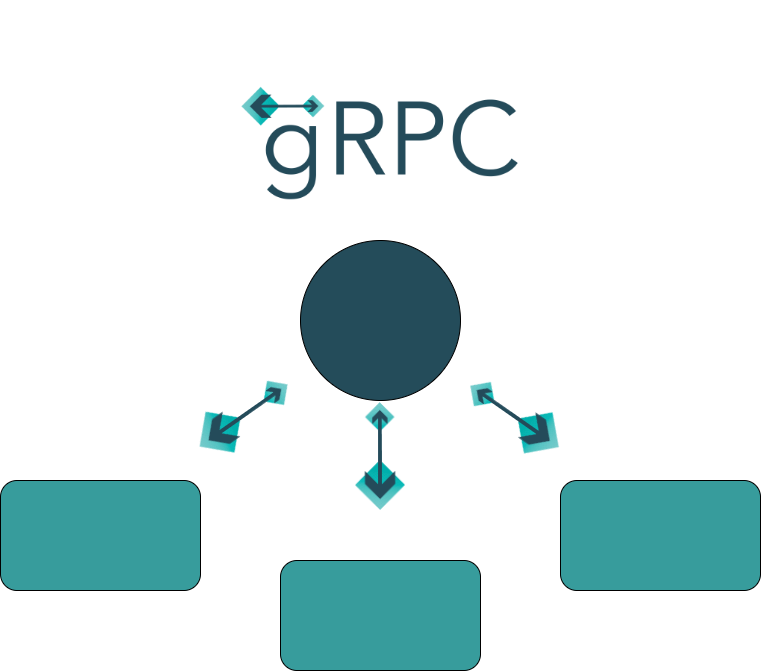
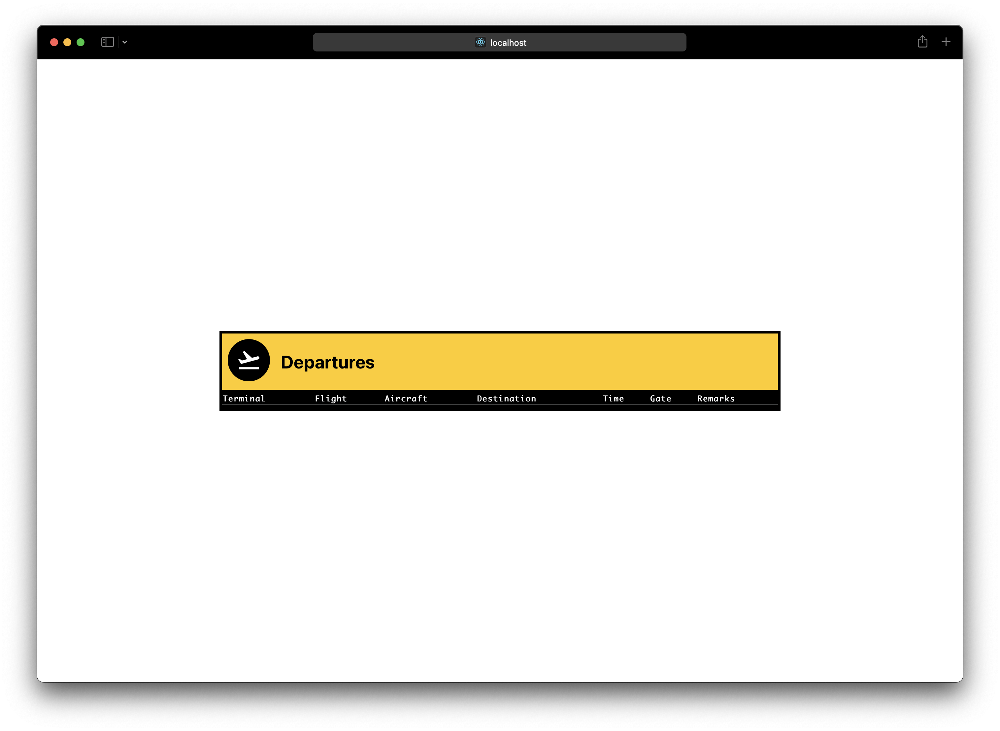
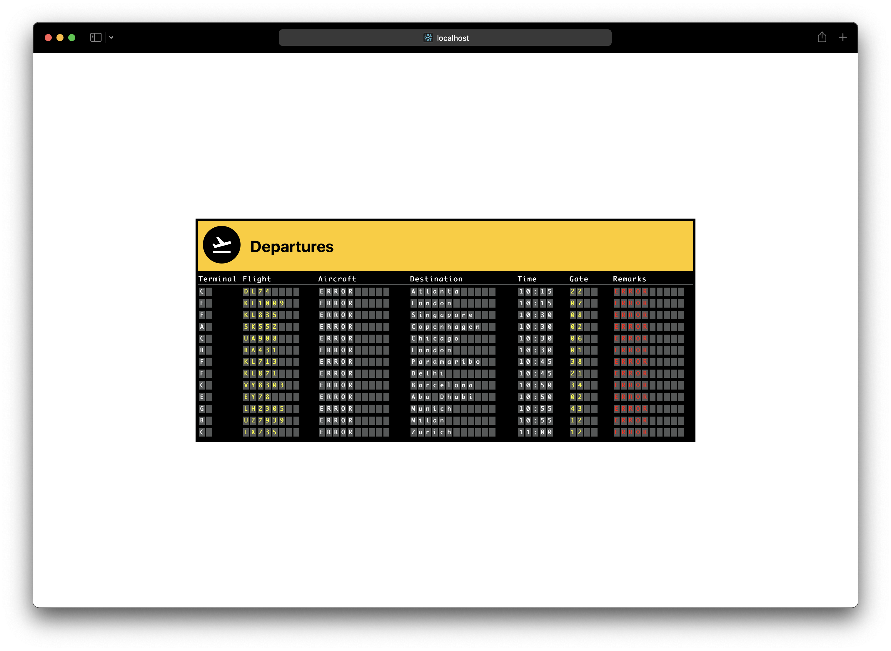
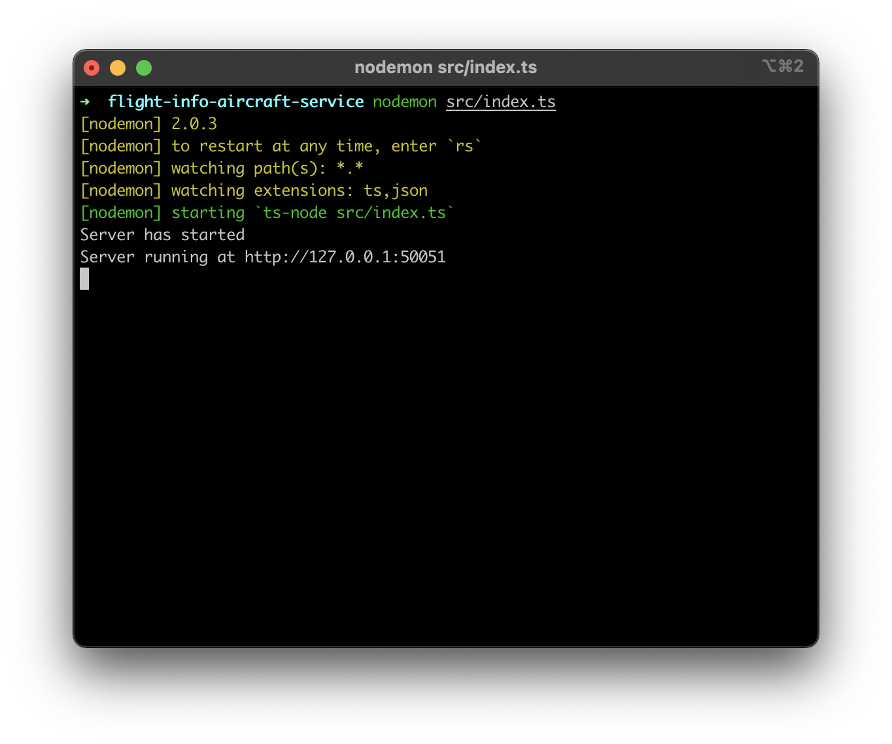
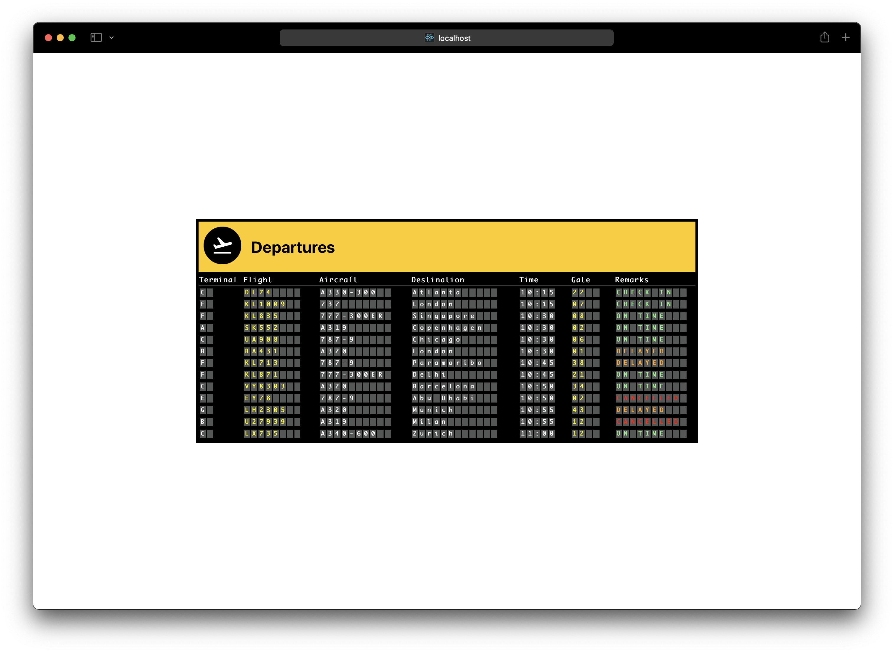

gRPC binnen een Microservice Architectuur
=========================================



- [gRPC binnen een Microservice Architectuur](#grpc-binnen-een-microservice-architectuur)
- [Wat is gRPC?](#wat-is-grpc)
- [Wat is het verschil tussen gRPC, REST en RabbitMQ?](#wat-is-het-verschil-tussen-grpc-rest-en-rabbitmq)
  - [Rest](#rest)
  - [RabbitMQ](#rabbitmq)
  - [gRPC](#grpc)
- [Hoe kunnen twee microservices in verbinding worden gesteld met behulp van gRPC?](#hoe-kunnen-twee-microservices-in-verbinding-worden-gesteld-met-behulp-van-grpc)
  - [gRPC Server (AircraftService)](#grpc-server-aircraftservice)
  - [gRPC client (flightService)](#grpc-client-flightservice)
- [Conclusie](#conclusie)
- [Literatuurlijst](#literatuurlijst)

Een kwestie waar je vaak tegenaan loopt is echter de communicatie tussen microservices. Gaan we de applicaties met elkaar laten praten doormiddel van REST? Een softwarebroker als RabbitMQ of Apache Kafka? Of misschien zelfs FTP? 

In deze post bespreek ik een relatief nieuwe speler op het gebied van communicatie: gRPC. Centraal staat de vraag "Hoe kan gRPC toegepast worden in een microservice architectuur?". Om deze vraag te beantwoorden is dit onderzoek opgesplitst in een aantal verschillende deelvragen, die ik in de komende paragrafen toelicht.

Na een stuk theorie besproken te hebben, geef ik een praktisch voorbeeld, die je zelf kunt volgen. De code die in dit voorbeeld wordt gebruikt is beschikbaar in deze repository, onder de map [casus](./casus/README.md). 

Het onderzoeksplan dat voorafgaand aan deze opdracht is opgesteld, is ook te vinden in de [repository](onderzoeksplan.md).

# Wat is gRPC?

> gRPC maakt het mogelijk om functies uit te voeren buiten de applicatie waar je je in bevindt, zelfs als de functie zich op een andere server in een ander continent bevindt.

[gRPC](https://grpc.io) is naar eigen zeggen een "High performance, open source universeel RPC framework". Dat is op zich nog niet veel zeggend, tenzij je de term "RPC" al kent. 

RPC, of Remote Procedure Call, is een protocol waarmee een programma een service aan kan roepen in een ander programma. Dat programma, kan echter ook een andere taal zijn, op een andere schijf staan, in een ander datacenter staan, of zelfs aan de andere kant van de wereld draaien. 

gRPC is een implementatie van dit protocol, van origine ontwikkeld door Google. Het protocol bouwt voort op het reeds bestaande, maar nog steeds relatief nieuwe, HTTP/2. De software biedt naast support voor vele verschillende programmeertalen ook load balancing, tracing, health checking en authentication aan. Tot slot kan dit protocol ook gebruikt worden om verschillende apparaten met elkaar in verbinding te stellen, zoals telefoons en webservers. 

Het mooiste zal zijn, om vanuit applicatie A simpelweg een functie in applicatie B uit te kunnen voeren. Dat is precies wat gRPC mogelijk maakt. Later in deze post meer over de specifieke technische details hiervan, nu eerst een vergelijk met andere protocollen die je wellicht wil gebruiken in je microservice architectuur.

# Wat is het verschil tussen gRPC, REST en RabbitMQ?

> gRPC heeft gelijkenissen en verschillen met REST en RabbitMQ. Het grootste voordeel van gRPC is type-safety en het feit dat bi-directionele streams ondersteund worden.

Zoals eerder al gezegd; geen van de technieken is een veel 'betere' oplossing dan de ander. Toch hebben bepaalde technieken wel een voordeel op een bepaald gebied. Stel bijvoorbeeld, dat applicatie A een open verbinding moet hebben met applicatie B, om bijvoorbeeld een live-chat te realiseren. REST (of HTTP) valt dan al enigszins af. 

Om goed te kunnen kijken naar de verschillen tussen de tools, is het verstandig om eerst helder te hebben wat welke tool nou precies is. Om te beginnen REST. Dit is (denk ik) een van de eerste protocollen waar je als software / web developer mee te maken krijgt. 

## Rest

REST, of 'representational state transfer', is een architectuurstijl die de interactie tussen RESTful services mogelijk maakt. Een typisch REST endpoint bestaat uit de volgende onderdelen: `http://api.airline.com/airplanes/1`. In dit voorbeeld hebben we het protocol en het domein (`http://api.airline.com`), de 'resource' (`airplanes`) en een identifier (`1`). 

Naar een dergelijk endpoint worden (doorgaans) JSON-berichten gestuurd in de body van een HTTP-request. Dit tezamen met de toepasselijke HTTP Method zorgt voor een gestructureerde API, met veel opties voor authenticatie. 

Een nadeel van REST is dat er geen type-safety is. Het zou dus goed kunnen, dat er een wijziging in de API gemaakt wordt, waardoor niet het veld `"Model": ""` maar het veld `"AirplaneModel": ""` verwacht wordt. Voor het request verstuurd wordt zijn er geen checks die valideren het request van het goede formaat is. Dat kan ervoor zorgen dat het request kaatst. 

Ook is het de vraag of er geen typefouten in de URL waar mee gecommuniceerd wordt zitten. Een kleine typefout zorgt er al voor dat het bericht niet aankomt en het beoogde resultaat dus niet wordt behaald.

## RabbitMQ

[RabbitMQ](https://www.rabbitmq.com) is een zogenaamde "Message Broker". De meest bekende implementatie van RabbitMQ is het gebruik van queues. Queues zijn in theorie een lijst waarop berichten worden gezet. Andere applicaties die op deze queue "luisteren", pakken de berichten die de "sender" op de queue heeft gezet op basis van het First-In-First-Out principe van de queue. 

RabbitMQ is een bekende manier van communiceren tussen microservices. Omdat de service veel verschillende soorten oplossingen heeft om communicatie in te regelen en zaken faciliteert als delivery acknowledgement, routing en reply-queues, is het een mooie oplossing waar veel uit gehaald kan worden. 

Onder water kan RabbitMQ op dezelfde techniek als gRPC draaien, namelijk RPC.

Echter heeft RabbitMQ vergelijkbare nadelen met REST. Er is geen gedeelde type-safety, wat ervoor zorgt dat het kan zijn dat de ontvanger een bericht niet accepteert. Ook is het zo dat het kan zijn dat er een typefout in de naam van de queue zit en het bericht dus niet bij de beoogde ontvanger aankomt.

Voor dat laatste heeft een broker als RabbitMQ (maar andere brokers ook) een mooie oplossing; Dead Letter queues. Hierop komen berichten terecht die naar een niet bestaande queue gestuurd worden, of waarvan de message TTL (Time To Live) verstreken is. Deze speciale queue kan later worden uitgelezen, om aan de ontwikkelaar door te geven. 

## gRPC

En dan de speler waarin wij geïnteresseerd zijn: [gRPC](https://grpc.io).

Als we deze tool vergelijken met REST en RabbitMQ, vallen er gelijkenissen te zien. Net als REST, communiceert gRPC ook via het HTTP-protocol. Een subtiel verschil is hierbij, dat gRPC gebruik maakt van het HTTP/2 protocol. Dit protocol is grotendeels ontwikkeld door Google zelf, welke ook de maker van gRPC is. Een groot verschil tussen HTTP/1.1 (het protocol dat een 'gewone' REST API gebruikt) en HTTP/2 is het gebruik van binaire communicatie in plaats van plain-text data-overdracht. Een andere grote ontwikkeling van HTTP/2 is dat streams ondersteund worden, wat in de basis neerkomt op een open verbinding waarin berichten heen en weer gaan van de client naar de server en weer terug. 

Een groot voordeel van gRPC zijn Google en haar "Protocol Buffers" (Protobufs). Over dit onderwerp alleen valt een heel onderzoek te schrijven, daarom houd ik het hier kort. Protobufs zijn "taal-neutrale, platform-neutrale, uitbreidbare mechanismen om gestructureerde data te serializeren" (Google, s.d.). Kort door de bocht, kunnen we eigenlijk zeggen dat een Protobuf een soort generiek object is, wat later met behulp van de [Protobuf Compiler](https://github.com/protocolbuffers/protobuf) vertaald kan worden naar een programmeertaal (of meerdere) naar keuze. Onderstaand voorbeeld komt direct van de Google Developers website:

```proto
message Person {
  required string name = 1;
  required int32 id = 2;
  optional string email = 3;
}
```

In de demo komen Protocol Buffers meer aan de orde, maar in het kort maken Protobufs het mogelijk om op een type-safe manier met behulp van gRPC te communiceren. Doordat de methods typesafe zijn, is het probleem van RabbitMQ en REST waar berichten niet aankomen door een typefout, of het probleem dat de body niet voldoet aan de eisen, verleden tijd.

# Hoe kunnen twee microservices in verbinding worden gesteld met behulp van gRPC?

Nu de theorie achterwegen is, tijd voor een demo. In deze (vrij eenvoudige) applicatie maken we een Front-End die informatie over vertrekkende vluchten van een luchthaven toont. Deze (React) front-end staat in verbinding met een ASP.NET Core API, de FlightService, die alles weet over vluchten en waar deze vandaan vertrekken.
De vliegtuigen zelf en de status daarvan, echter, zijn gesplitst naar een andere applicatie, de AircraftService (Zie het figuur hieronder voor een kort overzicht).


De communicatie tussen de FlightService en de AircraftService zijn de services die we in verbinding gaan stellen met gRPC.

Voor het uitvoeren van deze demo, is een gemiddeld programmeer-niveau vereist, om de wat complexere concepten te begrijpen. 

De code is te vinden in de `casus` map van deze [repository](https://github.com/dmvanderuit/grpc-onderzoek).

**Vereisten:**

- [NPM geïnstalleerd](https://docs.npmjs.com/downloading-and-installing-node-js-and-npm)
- Zowel Typescript als Nodemon globaal geïnstalleerd (`npm i --save-dev ts-node nodemon`)
- [Dotnet 5](https://dotnet.microsoft.com/download) geïnstalleerd
- [Docker](https://docs.docker.com/get-docker/) geïnstalleerd
- [Docker Compose](https://docs.docker.com/compose/install/) geïnstalleerd

Start de docker-compose door `docker-compose up -d` uit te voeren in de 'casus'-map. Dit start de databases. Hier gaan wij verder niets aan veranderen. 
Ook de front-end is een gegeven waar we niets aan gaan veranderen (tenzij je de API op een andere port draait dan gebruikelijk). Installeer de NPM-packages door `npm install` uit te voeren in de 'flight-info-front-end'-map en start de applicatie met het `npm start` commando.



Je ziet dat er nog geen data in de applicatie getoond wordt. Dit komt omdat de API nog niet draait.

Start de API volgens [de instructies](./casus/flight-info-flight-service/README.md) (het liefste met een IDE). Als de port van de API niet anders is dan 5001, zal de pagina nu data laten zien als je deze refresht (let op; dit kan eventjes duren. De database seed zichzelf met voorbeeld-data voor ieder request, om te zorgen dat er altijd data beschikbaar is voor de demo).



Zoals je ziet hebben we nu de data uit de FlightService, maar staan er een aantal 'error' meldingen op het bord. Dit komt omdat de AircraftService nog niet in verbinding staat met de back-end. 

## gRPC Server (AircraftService)

Open de 'flight-info-aircraft-service' in een IDE. Maak in de hoofdmap een nieuw bestand aan genaamd 'aircraft-service.proto' en plak daar het volgende in:

```proto
syntax = "proto3";
import "google/protobuf/empty.proto";

service AircraftService {
	rpc GetAircraft(google.protobuf.Empty) returns (AircraftResponse);
}

message Aircraft {
	int32 Id = 1;
	string Model = 2;
	int32 Capacity = 3;
	string Status = 4;
	string FlightNumber = 5;
}

message AircraftResponse {
	repeated Aircraft AllAircraft = 1;
}
```

Allereerst geven we aan wat de syntax is waar we mee werken, "proto3". Daarna importeren we een package van Google, om een lege parameter te ondersteunen.

In de "Service", wat vergelijkbaar is met een klasse geven we aan, dat we een "Remote Procedure Call" (RPC) hebben. In essentie is dit gewoon een functie die we later aan kunnen roepen. 

Tot slot geven we in deze RPC aan, dat we een lege parameter verwachten. We willen immers geen extra data meegeven, we willen simpelweg alle data hebben van de applicatie. Protobuf ondersteunt geen lege parameters, vandaar de import van 'Empty'. De return value van deze functie moet ook gedefinieerd worden. 

`AircraftResponse` is het object wat teruggestuurd wordt naar degene die de functie aanroept. Arrays zijn in Protobufs vertaald naar het 'repeated' keyword. We geven dus aan, dat we een herhaalde lijst van het type `Aircraft` terug willen sturen, die ook in onze `.proto` gedefinieerd staat. 

Een laatste opvallende zaak aan dit bestand is de cijfers achter de variabelen. gRPC werkt met binaire streams. Om deze reden moet het bestand weten wat de volgorde is waarin wij onze variabelen definiëren, wat gedaan wordt met de cijfers achter de variabelen.

Het lijkt nu nog ietwat onnodig, die Protobufs, maar op een later moment zal je begrijpen waarom deze techniek zo mooi is.

Nu gaan we daadwerkelijk iets programmeren. Voeg aan de AircraftService de packages `@grpc/grpc-js` en `@grpc/proto-loader` toe, door het volgende commando uit te voeren: `npm install @grpc/grpc-js @grpc/proto-loader`.

Open `index.ts` in de 'src'-map. Wat we als eerste gaan doen, is ons Proto-bestand importeren. 

Voeg de volgende imports toe:

```ts
import * as grpc from "@grpc/grpc-js";
import * as protoLoader from "@grpc/proto-loader";
```

Voeg nu `const PROTO_PATH = "./aircraft-service.proto";` toe aan het bestand, net onder de import-regels. Om vervolgens te zorgen dat onze Proto-loader snapt wat wij willen, moet er wat generieke configuratie worden gedefinieerd die we later gaan gebruiken. Voeg onder de `let dbClient = null;` de volgende variabele toe:

```ts
const options: protoLoader.Options = {
  keepCase: true,
  longs: String,
  enums: String,
  defaults: true,
  oneofs: true,
};
```

In de functie 'startApplication' zullen we het bestand nu daadwerkelijk in gaan laden. Voeg (na de database-try-catch) de volgende regels toe:

```ts
  const packageDefinition = await protoLoader.load(PROTO_PATH, options);

  const aircraftServiceProto = grpc.loadPackageDefinition(packageDefinition);
```

Deze twee regels zorgen ervoor, dat TypeScript ons proto-bestand compileert en bekijkt. Onder deze regel definiëren we onze gRPC server:

```ts
  const server = new grpc.Server();
```

Zoals eerder beschreven, heeft het Proto-bestand een definitie van een RPC, vergelijkbaar met een functie. Deze functie gaan we nu implementeren. 

```ts
  server.addService((aircraftServiceProto.AircraftService as any).service, {
    GetAircraft: async (_, callback) => {
      const aircraft = await getAllAircraft();
      callback(null, { AllAircraft: aircraft });
    },
  });
```

De invulling die we hier geven aan de 'GetAircraft' functie, is de functie die een gRPC client aanroept. In dit geval halen we alle vliegtuigen op met de `getAllAircraft()` functie, en geven we die terug aan degene die het request maakt.

Het enige wat nu nog gebeuren moet, is het 'binden' van gRPC aan een port. Dit start onze server. Voeg de volgende code toe, onder de ip en port definition:

```ts
  server.bindAsync(
    `${ip}:${port}`,
    grpc.ServerCredentials.createInsecure(),
    (error, port) => {
      console.log(`Server running at http://${ip}:${port}`);
      server.start();
    }
  );
```

En dan het moment van de waarheid (of in ieder geval een [deel van het uiteindelijk beoogde resultaat](https://www.agilealliance.org/glossary/frequent-release/)): Het starten van de server. 

Navigeer in je terminal naar de map waarin (onder andere) de `package.json` van de AircraftService staat. Voer het volgende commando uit: `nodemon src/index.ts`. Als alles goed is, zie je nu het volgende: 



De gRPC server draait. Nu de client nog.

## gRPC client (flightService)

Open in je IDE de FlightService (de API). Allereerst gaan we de benodigde dependencies installeren. Open het bestand 'FlightService.csproj' en voeg in de ItemGroup waar ook EntityFrameworkCore in staat de volgende packages toe:

```xml
        <PackageReference Include="Google.Protobuf" Version="3.18.1" />
        <PackageReference Include="Grpc.Net.Client" Version="2.40.0" />
        <PackageReference Include="Grpc.Tools" Version="2.41.0" />
```

Om vervolgens gebruik te kunnen maken van dezelfde Protobuf waar onze server gebruik van maakt (tada: hier is dan het moment waar we zien dat het handig is. Type safety over verschillende microservices :D), moeten we dit `.proto`-bestand ook aan de gRPC client toevoegen. Maak een nieuwe map in de root van de FlightService, genaamd "Proto". Kopieer het proto bestand die je eerder gemaakt hebt, en plak deze in de map, zodat je ook in deze map het `aircraft-service.proto` bestand hebt staan (maak je wijzigingen aan het proto bestand? Dan moet je dat dus in zowel de Server als de Client aanpassen!). 

Terug naar de 'FlightService.csproj': Om te zorgen dat de C# compiler de Protobuf herkent, moeten we deze toevoegen aan het project. Voeg de volgende configuratie toe onder de bestaande ItemGroup:

```xml
    <ItemGroup>
        <Folder Include="Protos" />
    </ItemGroup>

    <ItemGroup>
        <Protobuf Include="Protos\aircraft-service.proto" GrpcServices="Client" />
    </ItemGroup>
```

Om te zorgen dat we netjes werken en niet te veel aan onze code hoeven te zitten als er bijvoorbeeld een server-naam of een port verandert, voegen onze gRPC server URL toe aan de `appsettings.json` (of `appsettings.development.json`, afhankelijk van hoe je de applicatie start), onder onze "ConnectionStrings" (vergeet de komma na de '}' niet):

```json
"GrpcServer": "http://localhost:50051"
```

Dan nu nog de implementatie van de server. Vergeet niet om je project te builden (of 'restoren') voor je verder gaat, zodat de toegevoegde packages geïnstalleerd zijn.

Ga naar de 'Get' methode in 'FlightsController.cs'. Je ziet hier, dat we de Flights ophalen uit de database. Voeg de volgende code toe, onder de `await DatabaseSeeder.SeedDatabase(_context);`:

```cs
using var channel = GrpcChannel.ForAddress(_configuration.GetValue<String>("GrpcServer"));
            
var client = new AircraftService.AircraftServiceClient(channel);
```

Dit zet de verbinding op met de gRPC server. Om vervolgens de methode op de server aan te roepen, voegen we twee simpele regels code aan het bestand toe:

```cs
var reply = await client.GetAircraftAsync(new Empty());
var allAircraft = reply.AllAircraft;
```

En dat is het. gRPC, geïmplementeerd als ASP.NET client. Het enige wat nog moet gebeuren om de Front-End op de hoogte te stellen van onze nieuwe data, is het mappen van de data. Update de 'flightData' variabele, zodat het er als volgt uit ziet:

```cs
          var flightData = flights.Select(flight =>
            {
                var associatedAircraft =
                    allAircraft.FirstOrDefault(aircraft => aircraft.FlightNumber == flight.FlightNumber);

                return new FlightData
                {
                    Terminal = flight.Terminal,
                    FlightNumber = flight.FlightNumber,
                    Destination = flight.Destination,
                    DepartureTime = flight.DepartureTime,
                    Gate = flight.Gate,
                    Status = associatedAircraft?.Status,
                    AircraftModel = associatedAircraft?.Model
                };
            });
```

(Her)start de API, zorg dat de databases (docker-compose) en de gRPC server draaien en navigeer weer naar de Front-End. Als alles goed is, zie je het volgende als je je pagina herlaadt:



# Conclusie

gRPC is een tool die communicatie over het HTTP/2 protocol mogelijk maakt, door RPC te implementeren. Voornamelijk het feit dat gRPC type-safe is en cross-language implementaties ondersteunt, is een reden om de techniek te gebruiken. Ook ondersteunt de techniek bi-directional-streaming tussen client en server, wat bijvoorbeeld een chatapplicatie mogelijk kan maken.

Op de vraag of gRPC binnen jouw microservice-architectuur past, kan ik geen antwoord geven. RabbitMQ of zelfs het 'gewone' REST kunnen ook een hele goede optie zijn voor de architectuur van het project waar je aan werkt. 

gRPC is relatief simpel te implementeren, in ieder geval in TypeScript en C#. Door de client(s) en de server met elkaar in verbinding te stellen via de beschikbaar gestelde gRPC dependencies, kan eenvoudig een stabiele connectie opgesteld worden.

# Literatuurlijst

- DigitalOcean & Abcom. (2021, 23 juni). *HTTP/1.1 vs HTTP/2: What’s the Difference?*. DigitalOcean. geraadpleegd op 07-10-2021 van https://www.digitalocean.com/community/tutorials/http-1-1-vs-http-2-what-s-the-difference
- Google. (s.d.). *Protocol Buffers*. Google Developers. Geraadpleegd op 07-10-2021 van https://developers.google.com/protocol-buffers
- Google, & Mugur, M. (2015, 26 februari). *Introducing gRPC, a new open source HTTP/2 RPC Framework*. Google Developers Blog. Geraadpleegd op 06-10-2021 van https://developers.googleblog.com/2015/02/introducing-grpc-new-open-source-http2.html
- Grigorik, I., & Surma. (2019, 3 september). *Introduction to HTTP/2*. Google Developers. Geraadpleegd op 07-10-2021 van https://developers.google.com/web/fundamentals/performance/http2#streams_messages_and_frames
- gRPC Authors. (2021). *gRPC*. gRPC. Geraadpleegd op 06-10-2021 van https://grpc.io
- gRPC (s.d.). *gRPC*. gRPC.io. Geraadpleegd op 06-10-2021 van https://grpc.io/img/logos/grpc-logo.png (Logo in header-image).
- Larman, C., & Kruchten, P. (2005). *Applying UML and Patterns*. Prentice Hall. Geraadpleegd op 06-10-2021.
- RabbitMQ. (s.d.). *Dead Letter Exchanges — RabbitMQ*. RabbitMQ. Geraadpleegd op 07-10-2021, van https://www.rabbitmq.com/dlx.html
- Redhat. (2020, 8 mei). *What is a REST API?*. Redhat. Geraadpleegd op 07-10-2021 van https://www.redhat.com/en/topics/api/what-is-a-rest-api
- Van Wijk, E. (2017, 26 juni). *Web-scale aan de vergetelheid onttrekken*. Computable.nl. Geraadpleegd op 05-10-2021 van https://www.computable.nl/artikel/opinie/maatschappij/6049057/1509029/web-scale-aan-de-vergetelheid-onttrekken.html
- What is REST. (2021, 4 oktober). *REST API Tutorial*. Rest API Tutorial. Geraadpleegd op 07-10-2021 van https://restfulapi.net